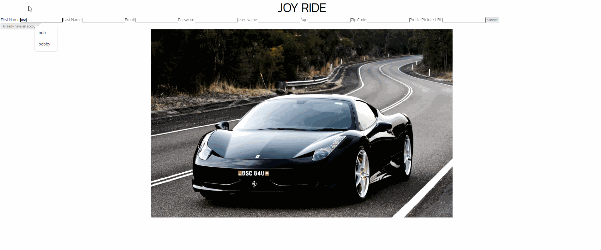
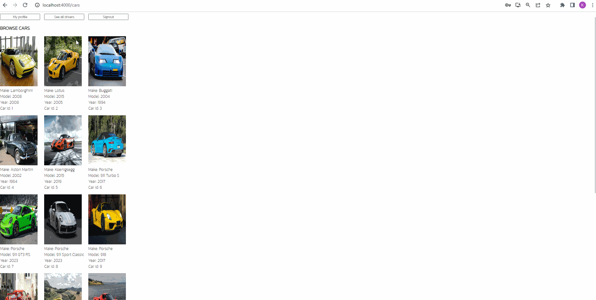
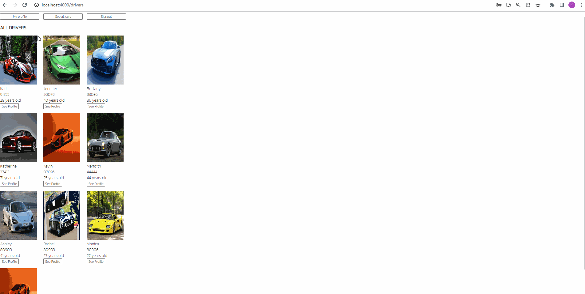
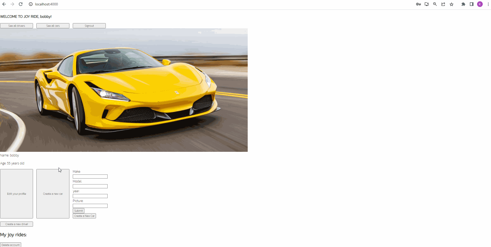
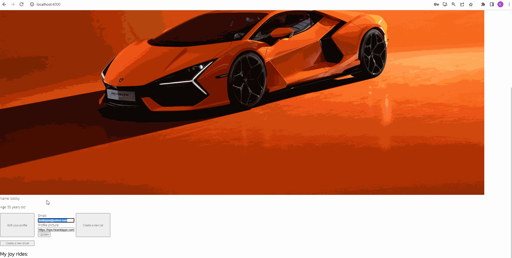
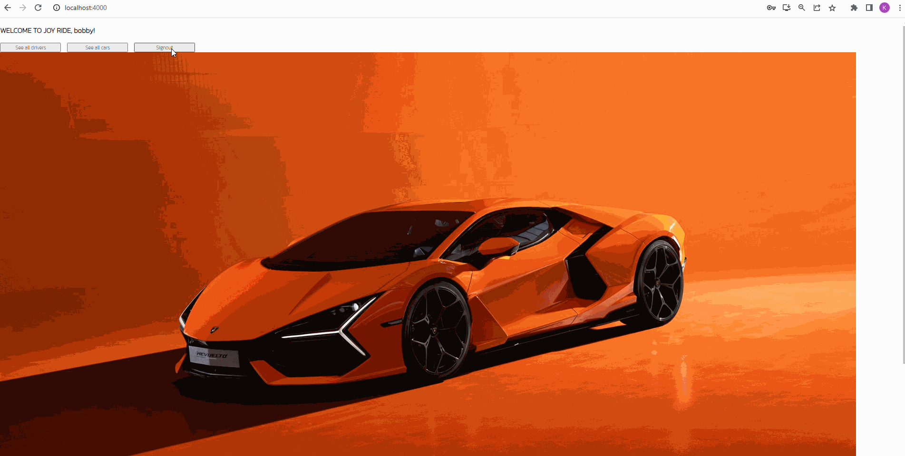
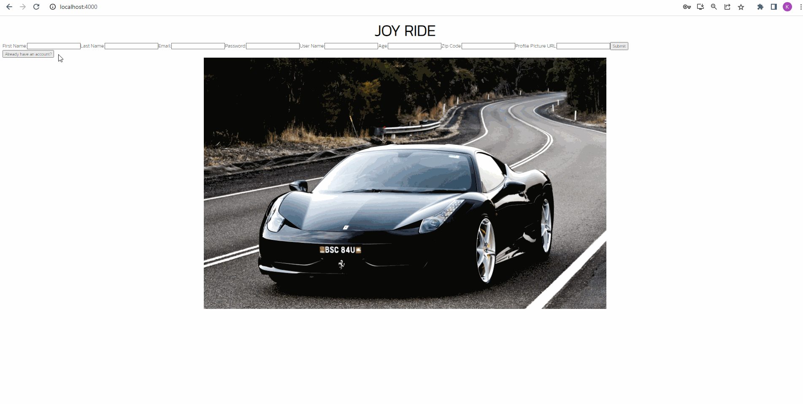

##  Front End Installation

To get the frontend server running, from your terminal, navigate into the client folder of the project and run the following commands: 

```bash
npm install
npm start
```

## Features

### Create a new account
Users will be able to fill out a form to signup for a new account


### Login 
Existing users can login using their email and password


### See all cars on the website
A signed-in user can check out all the existing cars on the website


### See other drivers on the website
A user can see other drivers 


### Create a car
A user can fill out a form and add a new car to the database and render their cars on their profile


### Edit a user's email / profile picture
A user can edit their existing email / picture using a form


### Signout
A signed-in user can sign out of their profile which brings them back to the home page


### Delete account
A signed-in user can delete their account which removes them from the database
